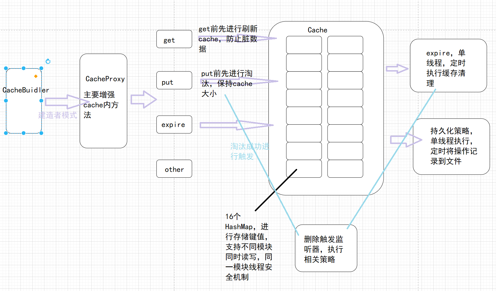

# 整体架构



## 特性

-  并发安全保障，使用读写锁，将cache分为16个区，各个区各采取单独的锁机制
- 自定义过期策略，与淘汰策略
-  内置了几种淘汰策略，支持fifo，lru，lruDoubleListMap，lruLinkedHashMap，lru2Q， CLOCK 算法  SC 二次机会
- 删除时触发监听器，发布事件
- RDB 和 AOF 两种存储策略

## 准备

导入项目，将api模块mvn install即可

## 入门测试

```
使用CacheBuilder.<String,String>newBuilder()创建cache，然后再使用cache进行操作，
```

```
    cache.put("1", "1");
    cache.put("2", "2");
    cache.put("3", "3");
    cache.put("4", "4");
    System.out.println((4==cache.size());
    cache.expire("1", 40);
    System.out.println((4==cache.size());
```


## 关于实现并发安全的点

重点在于cache的并发控制，全部系统的核心在与cache，所以只要解决了cache并发，基本上就没问题。

### 实现思路

16个HashMap，可以实现在同一时间内的读写安全，在其中一个或多个空间获得锁时，没有被锁住的其它空间仍然能够接受put和get请求，所用的锁为16个读写锁。

首先是cache内里的相关字段

```Java
Map数组有16个
private volatile Map<K,V>[] map=(Map<K, V>[]) new Map<?, ?>[segmentSize];

private static final  int segmentSize = 16;
用来确定键值放在16个空间哪一个空间中
private final int segmentMask=segmentSize-1;
16个读写锁
private final ReentrantReadWriteLock[] locks=new ReentrantReadWriteLock[segmentSize];
```

```Java
//具体添加逻辑
int segmentIndex=(key.hashCode()>>>16)&segmentMask;
try {
    locks[segmentIndex].writeLock().lock();
    return map[segmentIndex].put(key,value);
}finally {
    locks[segmentIndex].writeLock().unlock();
}
```

